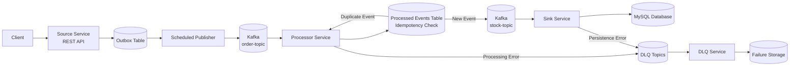

# Event-Driven Architecture with Spring Cloud Stream & Kafka

This project demonstrates how to design a **reliable, resilient, event-driven system** using **Spring Cloud Stream**, **Kafka**, and **Spring Boot**, addressing **real production problems** such as:

- message loss
- retry handling
- dead-letter queues (DLQ)
- broker unavailability
- resilience and fault isolation
- observability and testing

The goal is not to show *how to send a message*, but **how to not lose it**.

---

##  Architectural Goals

- **Reliability** – no message must be lost
- **Resilience** – Kafka downtime must not crash the system
- **Separation of concerns** – each microservice has a single responsibility
- **Controlled retries** – no infinite loops or blind retries
- **Observability** – failures are visible and traceable
- **Production-ready testing**

---

##  System Architecture

The system is composed of **four independent microservices**, communicating only via Kafka:

- **Source Application**
- **Processor Application**
- **Sink Application**
- **DLQ Application**

Configuration is centralized using **Spring Cloud Config Server**, with dynamic refresh via **Spring Cloud Bus**.

Kafka Topics:
- `order-topic`
- `stock-topic`
- `order-topic.dlq`
- `stock-topic.dlq`
- `spring-cloud-bus`

---

## Architecture

### Application Event Flow


---

## CI/CD and Deployment Flow


⚠️ Attenzione:  
- ci devono essere **tre backtick prima e dopo**
- dopo i primi backtick devi scrivere **`mermaid`**

Quando fai **commit e push**, GitHub lo renderizza automaticamente come grafico.

---

### 2️⃣ Subito dopo puoi mettere il secondo grafico

```markdown
### CI/CD and Deployment Flow

```mermaid
flowchart LR

Dev[Developer Push]

Repo[GitHub Repository]

CI[GitHub Actions Pipeline]

Build[Maven Build]
Tests[Run Tests]

Jib[Build Images with Jib]

Registry[Push Images to GHCR]

Auth[Authenticate to Google Cloud]

KubeCreds[Get Kubernetes Credentials]

Helm[Helm Upgrade Install]

Cluster[Google Kubernetes Engine]

Pods[Rolling Update Pods]

Dev --> Repo
Repo --> CI

CI --> Build
Build --> Tests

Tests --> Jib
Jib --> Registry

Registry --> Auth
Auth --> KubeCreds

KubeCreds --> Helm
Helm --> Cluster

Cluster --> Pods

```




---

##  Technologies Used

- **Spring Boot**
- **Spring Cloud Stream & Function**
- **Apache Kafka**
- **KafkaTemplate** (synchronous producer)
- **Spring Cloud Config Server**
- **Spring Cloud Bus**
- **Resilience4j (Circuit Breaker)**
- **Spring Scheduling**
- **MySQL**
- **Testcontainers**
- **Embedded Kafka**
- **Docker & Docker Compose**

---

## Observability

The system includes a basic observability stack to monitor both the infrastructure and the event-driven pipeline.

The following tools are used:
 - Prometheus – metrics collection and storage
 - Grafana – visualization and dashboards
 - Kafka Exporter – exposes Kafka broker metrics to Prometheus
This setup allows monitoring the health and behavior of the event-driven system in real time.

### Prometheus

Prometheus is responsible for scraping metrics from the various components of the system.
Metrics are collected from:
 - Kafka broker
 - Kafka exporter
 - microservices (via Spring Boot Actuator, if enabled)
Prometheus periodically scrapes the exposed metrics endpoints and stores them as time-series data.
This enables:
 - monitoring system health
 - identifying bottlenecks
 - tracking message flow metrics

### Kafka Exporter
Kafka does not expose Prometheus metrics natively in a convenient way.
To solve this, the system uses Kafka Exporter, which exposes Kafka metrics in Prometheus format.
 - Kafka Exporter provides metrics such as:
 - Kafka broker status
 - topic offsets
 - consumer lag
 - partition metrics
 - message throughput
Prometheus scrapes these metrics and stores them for visualization.

### Grafana
Grafana is used to visualize the metrics collected by Prometheus.
Dashboards can display:
 - Kafka consumer lag
 - topic throughput
 - broker availability
 - system resource usage
 - event processing metrics
This allows quick detection of issues in the event pipeline.

### Flow

Kafka Broker
     │
     ▼
Kafka Exporter
     │
     ▼
Prometheus
     │
     ▼
Grafana Dashboards


---

##  Microservices Overview

### 1️ Configuration Server
- Centralized configuration
- Properties stored in GitHub
- Dynamic refresh via Kafka (Spring Cloud Bus)

---

### 2️ Source Application (HTTP → Kafka)

**Responsibilities:**
- Accept HTTP requests
- Persist events using the **Outbox pattern**
- Send messages to Kafka via a scheduled job
- Handle retry, parking, and failure logic
- Protect itself using **Circuit Breaker**

**Why KafkaTemplate here?**

The Source is the only **synchronous entry point** (HTTP).
We need **acknowledgment from Kafka** to be sure the message has been accepted.

KafkaTemplate allows:
- synchronous send
- waiting for broker acknowledgment
- controlled failure handling

Spring Cloud Stream is intentionally **not used here**.

---

### 3️ Processor Application (Kafka → Kafka)

**Responsibilities:**
- Consume events from `order-topic`
- Validate incoming messages
- Enrich data (e.g. stock availability)
- Publish to `stock-topic`

This service uses **Spring Cloud Stream**:
- automatic retry
- automatic DLQ handling
- no Kafka-specific code
- fully asynchronous and decoupled

---

### 4️ Sink Application (Kafka → DB)

**Responsibilities:**
- Consume enriched events
- Validate payload
- Persist data

Any error (validation, mapping, DB failure) results in:
 automatic message redirection to DLQ.

---

### 5️ DLQ Application

**Responsibilities:**
- Consume messages from DLQ topics
- Persist failed events
- Periodically log / notify failures
- Ready to be extended with email or alerting

---

##  Reliability Patterns

###  Outbox Pattern
Ensures that HTTP events are **never lost**, even if Kafka is temporarily unavailable.

###  Parking Pattern
Messages that fail repeatedly are parked for manual inspection.

###  Circuit Breaker
Protects the Source application from wasting resources when Kafka is unavailable.

---

##  Testing Strategy

- **Embedded Kafka** for producer-side tests
- **Spring Cloud Stream Test Binder** for Processor & Sink
- **Testcontainers** for full integration testing
- Realistic failure simulation (broker down, retries, DLQ)

---

##  How to Run the Project

### 1. Clone the repository
git clone <REPO_URL>

### 2. Start infrastructure
docker-compose up -d

### 3. Send an order
POST /api/source
{
  "name": "phone",
  "cost": 12.5
}

### 4. Inspect Kafka topics
docker exec -it kafka bash
kafka-console-consumer --bootstrap-server kafka:9092 --topic order-topic --from-beginning


### 5. Inspect MySQL
docker exec -it mysql bash
mysql -uroot -proot
show databases;
use appdb;
show tables;

### 6. CI/CD (GitHub Actions + GHCR)

This repository includes a GitHub Actions pipeline that automates the build and delivery of the microservices.

What the pipeline does:
builds and tests the multi-module Maven project (mvn clean verify)
builds Docker images using Jib (no Docker daemon required)
pushes images to GitHub Container Registry (GHCR) under the Packages section of the repository

Image naming convention:
one image per microservice (recommended for independent deployments)
images are tagged with the commit SHA for immutable releases (recommended), optionally also latest

Example image reference:
ghcr.io/<owner>/configserver:<sha>
ghcr.io/<owner>/source:<sha>
ghcr.io/<owner>/processor:<sha>
ghcr.io/<owner>/sink:<sha>
ghcr.io/<owner>/dlq:<sha>

### 7. Kubernetes Deployment (Helm)

This repository includes a GitHub Actions pipeline that automates the build and delivery of all microservices.
The pipeline is triggered automatically on every push and performs the following steps:

#### Build & Test
The multi-module Maven project is compiled and verified:

mvn clean verify

This ensures that:
 - the project compiles correctly
 - all tests pass
 - the build is reproducible
  
#### Container Image Build
Docker images are built using Jib, which allows building container images directly from Maven without requiring a Docker daemon.
Each microservice produces its own container image.
#### Image Publishing
Images are pushed to GitHub Container Registry (GHCR) under the repository Packages section.
Each image is tagged using the commit SHA, providing immutable and traceable releases.

Example image references:

ghcr.io/<owner>/configserver:<sha>
ghcr.io/<owner>/source:<sha>
ghcr.io/<owner>/processor:<sha>
ghcr.io/<owner>/sink:<sha>
ghcr.io/<owner>/dlq:<sha>

This approach ensures:
 - immutable releases
 - traceable deployments
 - independent microservice versioning

### 8. Continuous Deployment on Google Kubernetes Engine (GKE)

After a successful build and image publication, the pipeline automatically deploys the system to a Google Kubernetes Engine (GKE) cluster.
This enables a fully automated CI/CD workflow, where code changes propagate directly to the running infrastructure.

#### Deployment Flow

- Authentication to Google Cloud
The GitHub Actions runner authenticates to Google Cloud using a service account.

Cluster credentials are retrieved using the Google Cloud CLI:

gcloud container clusters get-credentials <cluster-name> --region <region>

- Helm-Based Deployment
All services are deployed using Helm charts.
The pipeline performs an idempotent deployment using:

helm upgrade --install event-driven ./helm/environment/env-prod

This ensures:
 - repeatable deployments
 - versioned Helm releases
 - safe rollouts of updated microservices

# CI/CD DEPLOYMENT FLOW

Developer
   │
   │  git push
   ▼
┌──────────────────────────┐
│       GitHub Repo        │
└─────────────┬────────────┘
              │
              ▼
┌──────────────────────────┐
│    GitHub Actions CI     │
└─────────────┬────────────┘
              │
              ▼
        Maven Build
              │
              ▼
        Run Tests
   (Unit + Integration)
              │
              ▼
      Build Images
         with Jib
              │
              ▼
┌──────────────────────────┐
│  Push Images to GHCR     │
│ GitHub Container Registry│
└─────────────┬────────────┘
              │
              ▼
     Authenticate to
     Google Cloud (GCP)
              │
              ▼
Retrieve Kubernetes Credentials
              │
              ▼
        Helm Deployment
              │
              ▼
┌──────────────────────────┐
│ Google Kubernetes Engine │
│        (GKE Cluster)     │
└─────────────┬────────────┘
              │
              ▼
      Rolling Update
     of Microservices
              │
              ▼
       Running Pods
   (Source / Processor /
    Sink / DLQ / Config)

---

# APPLICATION FLOW

Client
   │
   │  HTTP POST /api/source
   ▼
┌──────────────────────────┐
│      Source Service      │
│      REST Controller     │
└─────────────┬────────────┘
              │
              │ Persist event
              ▼
       ┌───────────────┐
       │  Outbox Table │
       └───────┬───────┘
               │
               │ Scheduled Publisher
               ▼
        ┌───────────────┐
        │  Kafka Broker │
        │   order-topic │
        └───────┬───────┘
                │
                ▼
┌──────────────────────────────────────┐
│          Processor Service           │
│   Consume event from order-topic     │
└─────────────────┬────────────────────┘
                  │
                  ▼
       ┌─────────────────────────┐
       │ Idempotency Check       │
       │ (message key / eventId) │
       └───────────┬─────────────┘
                   │
        ┌──────────┴──────────┐
        │                     │
        ▼                     ▼
 Duplicate Event        New Event
        │                     │
        │ Skip processing     │ Persist received event
        │ / ignore            ▼
        │              ┌───────────────────┐
        │              │ Processor Storage │
        │              │ / Processed Table │
        │              └─────────┬─────────┘
        │                        │
        │                        │ Validate / Enrich
        │                        ▼
        │                 ┌───────────────┐
        │                 │ Kafka Broker  │
        │                 │  stock-topic  │
        │                 └───────┬───────┘
        │                         │
        │                         ▼
        │           ┌──────────────────────────┐
        │           │       Sink Service       │
        │           │     Persist to DB        │
        │           └─────────────┬────────────┘
        │                         │
        │                         ▼
        │                   ┌───────────────┐
        │                   │   MySQL DB    │
        │                   └───────────────┘
        │
        └─────────────────────────────────────────────


Error Handling Flow
-------------------

Processor validation / enrichment error ───────► order-topic.dlq
Sink persistence / mapping / DB error  ───────► stock-topic.dlq

DLQ Topics
   │
   ▼
┌──────────────────────────┐
│        DLQ Service       │
│ Persist & analyze errors │
└─────────────┬────────────┘
              │
              ▼
       Failure Storage

---


 Final Notes

This project is not a toy example.
The focus is not on frameworks, but on correct responsibilities, failure handling, and resilience.

